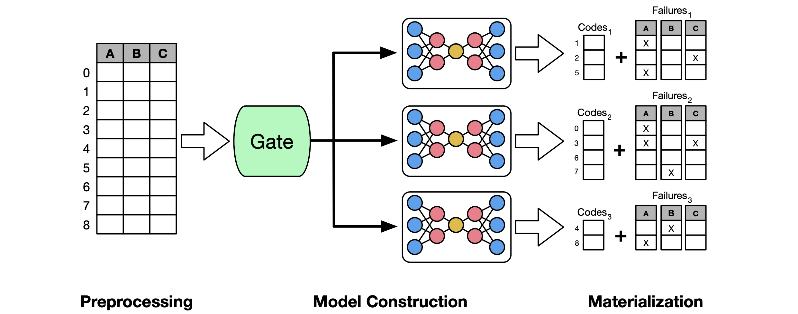

## Abstract

With the rapid proliferation of large datasets, efficient data compression has become more important than ever. Columnar compression techniques (e.g., dictionary encoding, runlength encoding, delta encoding) have proved highly effective for tabular data, but they typically compress individual columns without considering potential relationships among columns, such as functional dependencies and correlations. Semantic compression techniques, on the other hand, are designed to leverage such relationships to store only a subset
of the columns necessary to infer the others, but existing approaches cannot effectively identify complex relationships
across more than a few columns at a time.

We propose DeepSqeeze, a novel semantic compression framework that can efficiently capture these complex relationships within tabular data by using autoencoders to map tuples to a lower-dimensional representation. DeepSqeeze also supports guaranteed error bounds for lossy compression of numerical data and works in conjunction with common columnar compression formats. Our experimental evaluation
uses real-world datasets to demonstrate that DeepSqeeze can achieve over a 4× size reduction compared to state-of-the-art alternatives at the time of publication.