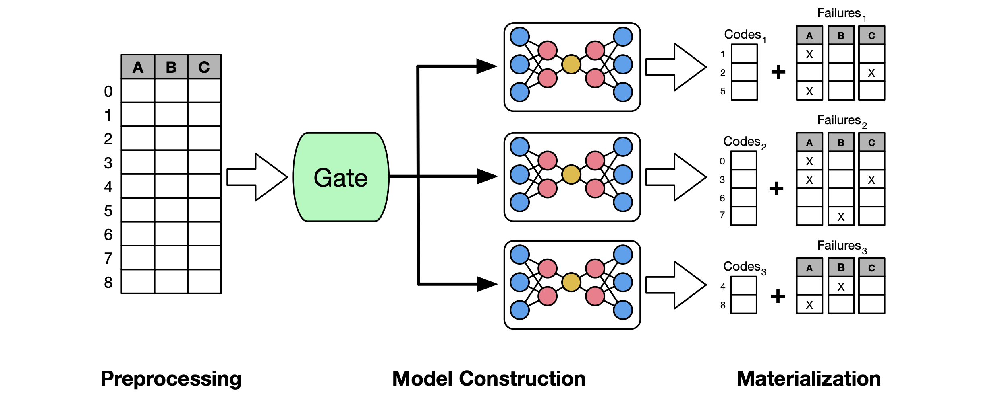

注：此中文版网页由大模型翻译获得

## 摘要

随着大型数据集的快速增长，高效的数据压缩变得比以往任何时候都更加重要。列式压缩技术（如字典编码、游程编码、增量编码）已被证明对表格数据非常有效，但它们通常只压缩单个列，而不考虑列之间可能存在的关系，如函数依赖性和相关性。另一方面，语义压缩技术旨在利用这些关系，仅存储推断其他列所需的列子集，但现有方法无法有效识别跨多个列的复杂关系。

我们提出了DeepSqueeze，这是一个新颖的语义压缩框架，它可以通过使用自动编码器将元组映射到低维表示来有效捕获表格数据中的这些复杂关系。DeepSqueeze还支持数值数据有损压缩的误差界限保证，并可与常见的列式压缩格式配合使用。我们的实验评估使用真实世界数据集表明，与发表时下最先进的方案相比，DeepSqueeze可以实现超过4倍的尺寸缩减。