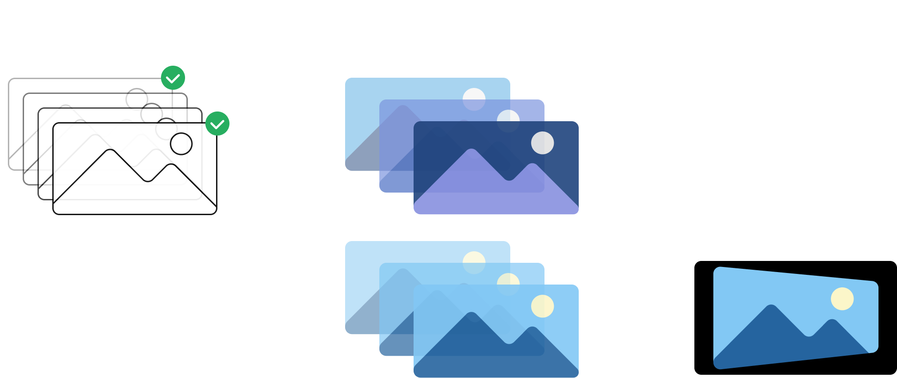

注：此中文版网页由大模型翻译获得

链接：[GitHub仓库](https://github.com/michaelmyc/hustl), [项目报告](hustl-writeup.pdf) \
成员：Michael Mao, Jiaju Ma, James Li \
时间：2019年春季

## 概述

制作优质的延时摄影视频很困难。通常需要摄影师在固定的距离间隔拍摄照片，并保持相机高度和镜头方向的稳定和平滑。或者，他们需要将相机安装在昂贵的稳定器或云台上。为了让创建高质量延时摄影变得更容易，我们推出了HUSTL（Hyper-Ultra-Super-Time-Lapse），这是一个基于最新学术研究论文的开源三阶段软件管线。我们的工具允许用户仅提供粗略的手持延时摄影帧来创建平滑的延时摄影视频。

这是布朗大学[CS 1430计算机视觉](https://cs.brown.edu/courses/info/csci1430/)课程的课程项目，该课程由[James Tompkin教授](https://jamestompkin.com/)讲授。

## 方法论

创建高质量延时摄影视频面临3个主要挑战：

1. 某些帧可能不够理想，应该被跳过
2. 帧可能具有不同的白平衡、光照条件，某些帧可能曝光过度或不足
3. 需要对齐帧以确保相机运动看起来平滑

为了解决这三个主要问题，我们提出了一个三步管线：帧选择[^1]、颜色匹配[^2]和视频稳定[^3]。

详细信息请参阅[项目报告](hustl-writeup.pdf)。

[^1]: Neel Joshi, Wolf Kienzle, Mike Toelle, Matt Uyttendaele, and Michael F. Cohen. [Real-Time Hyperlapse Creation via Optimal Frame Selection](https://dl.acm.org/doi/10.1145/2766954) *ACM Transactions on Graphics*, 2015
[^2]: Jaesik Park, Yu-Wing Tai, Sudipta Sinha, and In So Kweon. [Efficient and Robust Color Consistency for Community Photo Collections](https://www.microsoft.com/en-us/research/publication/efficient-color-consistency-for-community-photos/) *Computer Vision and Pattern Recognition (CVPR)*, 2016
[^3]: Shuaicheng Liu, Lu Yuan, Ping Tan, and Jian Sun. [Bundled Camera Paths for Video Stabilization](https://dl.acm.org/doi/10.1145/2461912.2461995) *ACM Transactions on Graphics*, 2013

## 演示

### Faunce拱门

  

    
<iframe src="https://player.vimeo.com/video/335471326?h=a82fe09ee9&color=ffffff&title=0&byline=0&portrait=0" style="position:absolute;top:0;left:0;width:100%;height:100%;" frameborder="0" allow="autoplay; fullscreen; picture-in-picture" allowfullscreen></iframe>

    
原始视频

  

  

    
<iframe src="https://player.vimeo.com/video/335471168?h=a82fe09ee9&color=ffffff&title=0&byline=0&portrait=0" style="position:absolute;top:0;left:0;width:100%;height:100%;" frameborder="0" allow="autoplay; fullscreen; picture-in-picture" allowfullscreen></iframe>

    
HUSTL处理后

  

### 士兵纪念门

  

    
<iframe src="https://player.vimeo.com/video/335471673?h=a82fe09ee9&color=ffffff&title=0&byline=0&portrait=0" style="position:absolute;top:0;left:0;width:100%;height:100%;" frameborder="0" allow="autoplay; fullscreen; picture-in-picture" allowfullscreen></iframe>

    
原始视频

  

  

    
<iframe src="https://player.vimeo.com/video/335471545?h=a82fe09ee9&color=ffffff&title=0&byline=0&portrait=0" style="position:absolute;top:0;left:0;width:100%;height:100%;" frameborder="0" allow="autoplay; fullscreen; picture-in-picture" allowfullscreen></iframe>

    
HUSTL处理后

  

## 需要改进的领域

如演示所示，尽管相机运动已经被平滑处理，但仍然存在一些影响延时摄影质量的问题：

1. 物体可能会出现不自然的扭曲，特别是在图像角落，尤其是在需要大幅度扭曲视频图像时
2. HUSTL在狭窄的环境（如走廊）中表现不佳，因为与开放环境相比，物体相对较快地移出画面
3. 在明亮和昏暗环境之间过渡时，HUSTL可能导致不自然的光照效果和意外的亮度变化

我们认为更好的视频稳定算法（类似Adobe Premiere中的"Warp Stabilizer"）可能更适合解决前两个问题。解决第三个问题的潜在方法可能是：

1. 将色彩空间投影到对数空间，以减少调整亮度时信息丢失的风险
2. 调整图像使所有帧的亮度（平均亮度）保持一致
3. 通过HUSTL颜色一致性管线处理图像
4. 将对数空间投影回正常的线性色彩空间