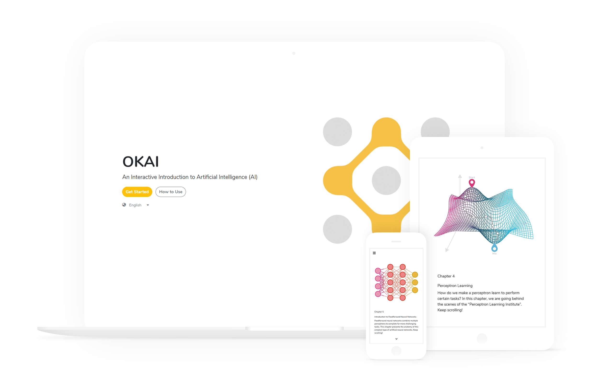
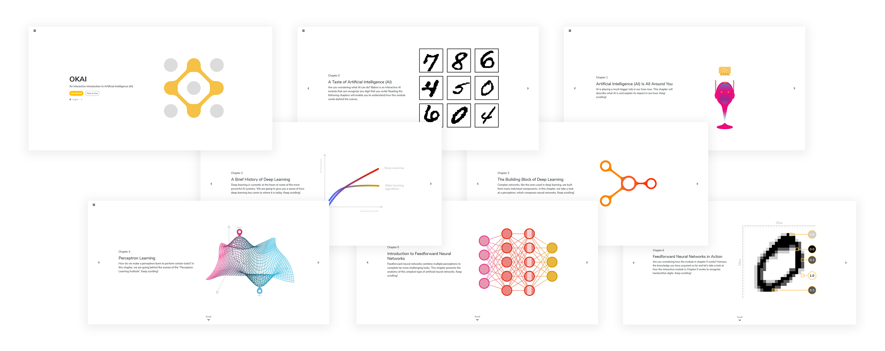
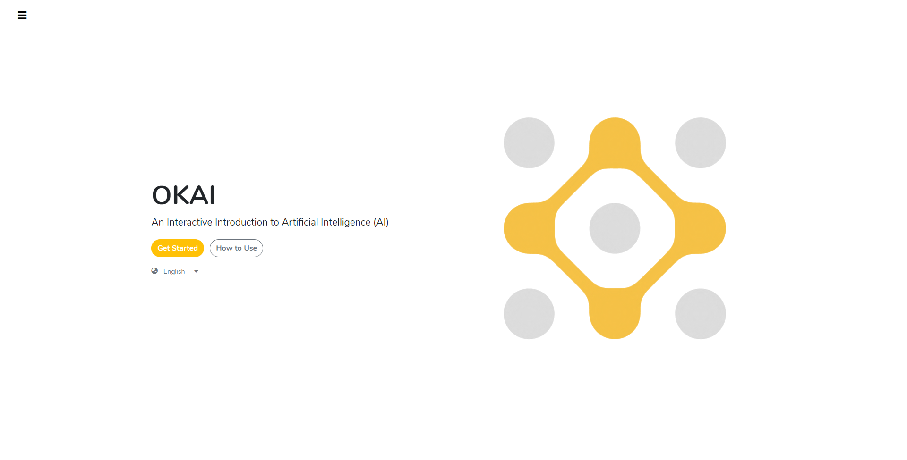

注：此中文版网页由大模型翻译获得

链接：[网站](https://okai.brown.edu) \
成员：[Jiaju Ma](https://majiaju.io), Michael Mao, [Yimei Hu](http://yimeihu.com/) \
时间：2018年9月 - 2019年5月 \
页面浏览量：160k+ \
用户数：38k+

## 概述

OKAI是人工智能（AI）的交互式入门教程。该项目旨在向计算机科学背景有限或没有背景的更广泛受众揭秘并介绍机器学习和深度学习概念。它利用基于网络的交互式图形和动画来可视化展示在MNIST数据集上简单前馈神经网络分类器的工作原理。

我是OKAI的AI专家，负责构思教材内容并撰写了6章中的5章。我还与Jiaju Ma合作构思了更多数学导向的动画概念。

## 使命和方法论

从《黑客帝国》到《终结者》再到《2001太空漫游》，科幻小说和流行文化中不乏描绘失控的AI威胁人类的情节。我们相信，通过更多地了解最新AI算法的基本原理，人们会更容易接受AI技术。此外，我们希望我们的项目能在新一代学生中激发对AI和计算机科学的好奇心。

因此，我们的目标是在不涉及复杂的大学水平数学的情况下解释简单的深度学习概念。为了实现这个目标，我们选择了将交互式图形与简短的解释和日常类比相结合。这有效地避开了线性代数和微积分，展示了简单前馈神经网络的核心数学直觉。

## UI/UX设计

要了解更多关于UI/UX设计过程的信息，请参阅Jiaju网站上精彩的[项目说明](https://majiaju.io/okai)。