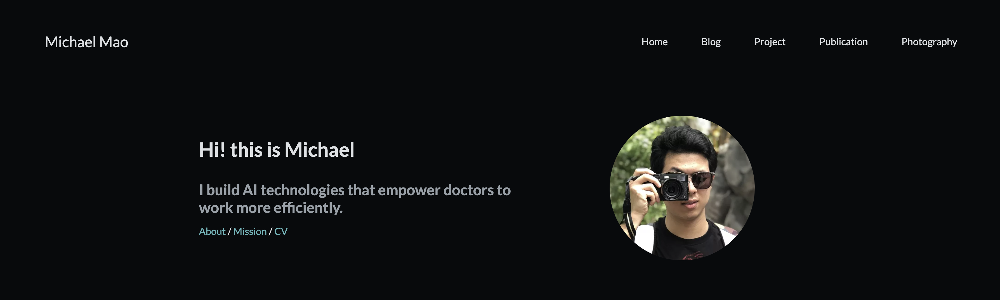
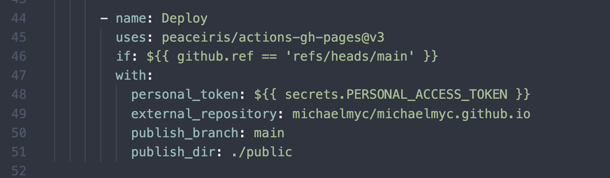

注：此中文版网页由大模型翻译获得

链接：[GitHub仓库](https://github.com/michaelmyc/michaelmao.me)，[示例博文](/blog/example-blogpost)

## 概述

这个个人网站是使用[Hugo](https://gohugo.io/)框架从零开始构建的。配色方案受[Nord主题](https://www.nordtheme.com/)启发，所有代码块都使用Nord配色方案。网站采用响应式设计，同时适配移动端和桌面端，支持纵向和横向屏幕浏览。

### 主页和博客

网站提供可定制的主页或着陆页，以满足不同用户的需求。

网站还包含一个完整的博客系统，具有完善的markdown支持、分页和按日期分组、标签支持以及系列/合集支持。查看[示例博文](/blog/example-blogpost)了解已测试和支持的功能。如果需要一次性的自定义功能，markdown支持HTML混合，因此直接在markdown文件中编写HTML代码即可渲染HTML内容。

请注意，"系列"和"标签"页面不会显示仅包含隐藏博文的系列或标签。但您仍可以通过正确的URL访问隐藏博文。

### 项目

网站还设有个人项目板块。这个板块采用支持横幅图片的卡片设计。点击卡片可以查看常规博文格式的内容，用于详细解释该项目。

### 摄影

我还加入了一个摄影板块，采用三列瀑布流设计（如果屏幕足够宽）来展示图片。图片排序为手动设置，图片可以跨越多列以实现最佳视觉布局。

## 改编此网站

您可以通过fork我的[GitHub仓库](https://github.com/michaelmyc/michaelmao.me)轻松改编此网站。

### 移除我的内容

要清除我的内容，您应该删除`content`目录下的所有文件。

`layouts/_index.html`是主页，您可能需要根据自己的需求进行定制。

其他您可能想要定制的内容包括`layouts/partials/footer.html`中的页脚，以及`static`目录下的favicon、封面图片和CNAME文件。

### 添加您的内容

网站的大部分内容可以通过`config.toml`文件配置。设置应该相当直观。您还应该在`static`目录中添加自己的CNAME、封面图片和favicon。

要添加特定类型的页面（博客/项目/摄影），使用`hugo new [语言]/[类型]/[名称]`命令将根据`archetypes`目录中的相关模板在`content`文件夹中创建页面。

### 自动部署到GitHub Pages

该仓库支持使用[GitHub Workflows](https://docs.github.com/en/actions/using-workflows)进行CI。这意味着对仓库的任何推送都会自动构建并发布为GitHub Pages。如果您不使用GitHub Pages托管您的网站，您应该删除`.github`文件夹。如果您想将此功能适配到您自己的GitHub Pages，您需要根据您的设置修改`.github/workflows/deploy-site.yml`的最后几行：

